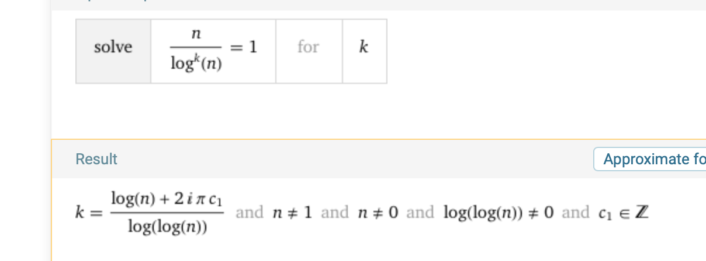
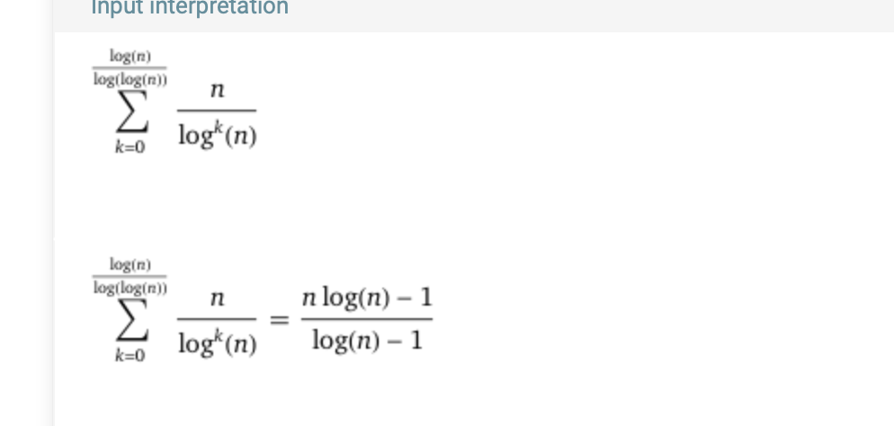

# Алгоритмы и структуры данных. Домашнее задание №2

## Выполнил студент Наседкин Дмитрий Сергеевич (группа 242)

## Письменная часть

### № 1

На лекции было, что время работы извлечения минимума в $k$-ичной куче составляет $O(k*\log_k{n})$ - время работы операции `sift_down(int v)`, где $n$ - кол-во вершин в куче.

Точно также, время операции добавления элемента в $k$-ичной куче равно $O(\log_k{n})$ - время работы операции `sift_up(int v)`, где $n$ - кол-во элементов в куче.

Пусть $k = n^{b - a}$ (вероятнее всего, вам максимально не хочется видеть пол страницы формул для вывода $k$, поэтому будем считать, что это нам приснилось), тогда посчитаем общее время работы структуры:

- Операция добавления 1 элемента работает за $O(\log_{n^{b - a}}{n^b}) = O(\frac{b}{b - a} * log_nn) = O(\frac{b}{b - a})$
- Операция добавления $n^b$ элементов работает за $O(n^b * \frac{b}{b - a}) = O(n^b)$, так как $\frac{b}{b - a}$ - это константа
- Операция извлечения минимума работает за $O(n^{b - a} * log_{n^{b - a}}{n^b}) = O(n^{b - a} * \frac{b}{b - a})$
- Операция извлечения минимума $n^a$ раз работает за $O(n^a * n^{b - a} * \frac{b}{b - a}) = O(n^b * \frac{b}{b - a}) = O(n^b)$, так как $\frac{b}{b - a}$ - это константа

Заметим, что $k$ может оказаться нецелым числом, тогда округлим $k$ наверх, при этом время работы останется тем же(не считая константы).

Также отметим, что случая, когда $b - a \leq 0$ не бывает, так как $0 < a < b$ задано в условии.

### № 2

#### Подготовка и предподсчет

Давайте разделим отрезок [0, 1] на n равных частей([0, 1/n), [1/n, 2/n) и т.д. до [n - 1/n, n), отдельно закостылим точку 1 создав для нее отдельный отрезок, при этом формально частей будет n + 1), отметим, что при этом для любой точки на этом отрезке можно определить ту часть, в которую она попадает(разделим на $\frac{1}{n}$, после чего округлим вниз, так получим индекс нужной части).

Теперь для каждой части создадим вектора точек, которые попали в эту часть отрезка [0, 1].
Также для каждой части посчитаем первую справа, слева непустую часть(там где вектор непуст), очевидно, что это делается за 2 прохода, то есть O(n).

На лекции с помощью амортизированной оценки получили, что суммарно "пушбаки" работают за O(n), итого сделали предпосчет за гарантированное O(n).

#### Ответы на запросы

Не умаляя общности, заранее скажем, что пусть равных отрезков все таки n(так как очевидно, что на случайных входных данных вероятность выпадения точки 1 равна 0), но даже если она есть, это не меняет логики рассуждения(я надеюсь никому не хочется копаться в таком).

Для начала докажем, что матожидание кол-ва точек в каждой части равно O(1).

Для этого введем следующую индикаторную величину для части:
$$I_k =
    \begin{cases}
    1,     \;\;\;  \text{если k-ная точка попала в текущий полуинтервал}\\
    0,     \;\;\;  \text{иначе}
    \end{cases}$$

Тогда матожидание значения кол-ва точек в полуинтервале $i$ равно:
$$E(\xi_i) = \displaystyle\sum_{k = 1}^{n} E(I_k) = \displaystyle\sum_{k = 1}^{n} p_{\text{точка попадет в i-ный полуинтервал}},$$

Так как $p_{\text{точка попадет в i-ный полуинтервал}} = \frac{1}{n}$ тогда получим:
$$E(\xi_i) = \displaystyle\sum_{k = 1}^{n} \frac{1}{n} = \frac{n}{n} = 1$$

Тогда не важно, случайны ли запросы или нет получим, что кол-во точек в каждой из частей $O(1)$, тогда ответ на запрос очевиден, определим в какой полуинтервал попала точка, тогда возьмем минимум из ответов для 3 полуинтервалов, того, что первый непустой слева, для текущего, а также для первого непустого правого. Для поиска ответа для полуинтервала воспользуемся формулой из условия $|x − ai| → min$

Так как в каждом из них ожидаемо $O(1)$ точек получим, что и ответ на запрос ожидаемо за $O(1)$.

### № 3

Найдем max и min среди точек на прямой за проход($O(n)$), получается, что все числа принадлежат отрезку [$mn, mx$], где $mn, mx$ - минимум и максимум соответственно. Пусть также $mx - mn = L$.

Считаем, что $L \neq 0$, так как если $L = 0$, ответ очевидно равен 0 и можем завершиться.

Разделим отрезок [$mn, mx$] на n + 1 часть следующим образом(везде округления вниз):

- За первую часть отвечает полуинтервал $[mn, mn + \frac{L}{n})$
- За вторую $[mn + \frac{L}{n}, mn + \frac{2L}{n})$, 
- $\dots$,
- За $n$-ую часть $[mn + \frac{L * (n - 1)}{n}, mx)$,
- За $n$ + 1 часть - точка $mx$

То есть точка x $\in [mn, mx]$ попадет в часть с номером $\frac{(x - mn) * n}{L}$.

**Замечание**: Некоторые части могут получиться длины 0, однако нам это и не важно.

Для каждой части создадим вектор отвечающий за него, и проходом для каждой точки сделаем "пушбак" в соответсвующий для данной точки вектор(как определили выше). Также для каждой непустой части посчитаем $max, min$, обозначим их $max_i, min_i$ и найдем первый справа непустой вектор. Так как суммарно точек n, то проход по всем векторам и подсчет мин/макс для каждого будет работать суммарно за линию, а подсчет первого не пустого справа тоже делается за линию(идем с обратной стороны поддерживая текущий непустой).

Заметим, что в первую и последнюю часть попадет хотя бы по одной точке(так как это будут минимум и максимум соответственно).

Также заметим, что ответ точно не лежит внутри блока, так как если существует хотя бы один "пустой" блок получим, что разность каких-то соседних точно будет больше чем длина блока, а внутри блока такого мы не добьемся, а если пустых блоков не существует, то получим что в каждом блоке ровно 1 число, а значит ответ все равно не лежит внутри блока.

Тогда ответ считается так:
- Пройдемся по каждому блоку(кроме последнего) и выберем среди ответов для каждого минимальный
- Для текущего блока ответ - разность минимального элемента в первом блоке справа и максимального в текущем.

При этом очевидно, что все нужное мы уже посчитали, а значит будет работать за линию, то есть итоговое время работы составит $O(n)$.

Последний блок не берем, так как в нем или 1 элемент и следущего за ним числа просто нет, или в нем несколько, но тогда разность = 0, а мы точно найдем ответ лучше.

## Устная и письменная часть

### № 4

Сделаем предподсчет за $O(n)$, после чего мы можем хранить в Atomic heap $\log{(n)}$ элементов, и для этой кучи все операции работают за $O(1)$.

Алгоритм:
- Разбить массив длины $n$ на блоки длины $\log{(n)}$, все элементы из блока положить в $\text{atomic heap}$, блоков получится $\dfrac{n}{\log{(n)}}$.
- Из каждого блока найдем за $O(1)$ минимальный элемент, образуем новый массив.
- Назовем наш изначальный массив слоем 0, а полученный и массив, и кучи(из $\frac{n}{\log{(n)}}$ элементов) слоем 1. Очевидно, что вся данная процедура работает за $O(\text{кол-во элементов на слое})$(в случае первого слоя получим $n$).
- Повторим данную процедуру для 1 слоя, получив 2, далее повторим для 2, получив 3 слой, и т.д. (разбить массив на блоки длины $\log{(n)}$) до тех пор, пока на последнем слое не получится 1 элемент.

Получим некое дерево. Время построения дерева будет $O(\text{сумма размеров слоев})$.

Сортировать будем следующим образом, найдем минимум, поставим его на место 1 в массиве для ответа, найдем следующий минимум, поставим на место 2 и так далее(как в сортировке выбором).

Как получить минимальный элемент на $i$-ном шаге?

Возьмем корень дерева(куча на самом нижнем слое), из нее достанем минимальный элемент за $O(1)$, посмотрим, где лежал этот элемент на предыдущем слое(для этого храним ссылки на кучу, где лежал элемент на предыдущем слое вместе с самими элементами), таким образом передем на слой выше. В конце концов, переходя по ссылкам дойдем до листка(изначального массива), это и будет наш минимальный элемент на текущем шаге. Теперь начнем откатываться:
- Откатимся в предка, удалим минимум из кучи(это и есть наш элемент) за $O(1)$, сделаем вставку в кучу(минимум из сына из которого мы пришли), если конечно элементы в сыне еще остались.

Таким образом $i-ный$ шаг выполняется за $O(\text{высота дерева})$, тогда $n$ шагов за $O(n * \text{высота дерева})$.

Осталось посчитать сумму размеров слоев и высоту дерева, давайте посчитаем для начала высоту:
- На каждом шаге мы делимся на $\log{(n)}$ блоков, тогда нужно решить уравнение:
$$ \frac{n}{log^k{(n)}} = 1 $$

P.S. Я не умею решать такие уравнения, но знаю, что вульфрам может(все таки не матан, а курс алгоритмов)

То есть высота дерева равна $O(\frac{\log{(n)}}{\log{\log{(n)}}})$, то есть $n$ шагов выполнится за $O(\frac{n\log{(n)}}{\log{\log{(n)}}})$.

Сумма размеров слоев же считается следующим образом:
- На первом слое $n$ элементов
- На втором слое $\frac{n}{\log{(n)}}$
- $\dots$
- На $\frac{\log{(n)}}{\log{\log{(n)}}}$ слое 1 элемент.

Тогда сумма слоев считается по формуле:
$$\displaystyle\sum_{k = 1}^{\frac{\log{(n)}}{\log{\log{(n)}}}} \frac{n}{\log^k{(n)}}$$

P.S. Я не умею находить такие суммы, но знаю, что вульфрам может(все таки не матан, а курс алгоритмов)

То есть сумма слоев равна $O(\frac{n\log{(n)}}{\log{(n)}})$.

Так и получим нужное время работы:
- $O(\frac{n\log{(n)}}{\log{(n)}})$ + $O(\frac{\log{(n)}}{\log{\log{(n)}}})$ = $O(\frac{\log{(n)}}{\log{\log{(n)}}})$

### № 5

Пусть дан массив из $n$ элементов данного типа, тогда запустим следующую процедуру:
- Добавим в волшебную структуру все элементы, после чего сделаем запрос медианы, таким образом получим $\lceil\frac{n}{2}\rceil$ по возрастанию элемент, потратив $n$ операций.
- Разделим массив на 2 части, те что больше медианы, меньшее ее, и сама медиана(можно положить в одну из частей)
- Те, что больше медианы положим в новую волшебную структуру, после чего достанем $\lceil\frac{3n}{4}\rceil$ элемент по возрастанию.
- Добавив в эту же структуру 1-2 элемента меньших или равных медиане получим $\lceil\frac{3n}{4}\rceil - 1$ элемент по возрастанию
- Повторим процедуру до тех пор, пока не получим $\lceil\frac{n}{2}\rceil + 1$ элемент, суммарно при этом мы добавили не больше чем $\lceil\frac{n}{2}\rceil$ элементов в структуру. Такии образом получили все элементы в отсортированном порядке от $\lceil\frac{n}{2}\rceil$ до $\lceil\frac{3n}{4}\rceil$

Точно также сделаем для элементов от $\lceil\frac{n}{4}\rceil$ до $\lceil\frac{n}{2}\rceil$(для этого понадобиться создать еще одну волшебную структуру), при этом добавив также не больше чем $\lceil\frac{n}{2}\rceil$ суммарно в структуру.

Потратим еще n действий, чтобы разделить массив на 3 части: все элементы меньшие чем $\lceil\frac{n}{4}\rceil$-ый, все элементы с $\lceil\frac{n}{4}\rceil$ до $\lceil\frac{3n}{4}\rceil$, все элементы большие чем $\lceil\frac{3n}{4}\rceil$-ый. 2 часть отсортирована(половина элементов). После чего запустимся от 1 и 3 части рекурсивно.

#### Время работы алгоритма

Заметим, что каждый раз мы делим массив на 3 части, при этом запускаясь от 1 и 3, выполняя при этом $\leq 16n$(немного с запасом) операций, тогда время работы алгоритма равно: $T(n) = 2 * T(\frac{n}{4}) + 16n$

Докажем, что $T(n) \leq 100 * n$ по индукции:
- База очевидна $T(1) = 1 \leq 100$
- Переход: пусть $T(m) \leq 100 * m \;\; \forall m < n$, докажем, что $T(n) \leq 100 * n$:
$$ T(n) = 2 * T(\frac{n}{4}) + 16n $$
$$ T(n) \leq 200\lceil\frac{n}{4}\rceil + 16n \leq 50n + 200 + 16n$$
$$ T(n) \leq 66n + 200 \leq 100n,$$

последний переход верен, для любых $n \geq 6$.

Таким образом доказали, что алгоритм работает за O(n) по определению.

### № 8

#### a)

Давайте запустим сортировку пузырьком на "склееном массиве", то есть единственное различие, что если индекс $i \geq n$(0-индексация), то это будет $b[i - n]$-ный элемент, иначе же $a[i]$-ный.

Так мы используем сортировку пузырьком("бубле сорт"), то не нужно доказывать корректность, время работы, количество дополнительной памяти и ее стабильность, они будут равны $O(n^2)$, $O(1)$, и стабильна соответственно.